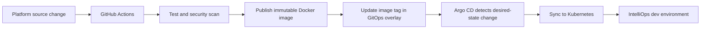

# IntelliOps GitOps

Declarative Kubernetes delivery repository for the IntelliOps SaaS platform. It contains the desired state consumed by Argo CD: application workloads, shared infrastructure, environment overlays, scheduled analytics jobs, ingress rules, and bootstrap manifests.

The application source code and CI workflows live in [IntelliOps Platform](https://github.com/Oumhella/IntelliOps-Platform).

## Delivery model



Application images are pinned to immutable commit-based tags in the development overlay. Runtime changes should therefore enter the cluster through a reviewed Git commit, not through manual edits to live Kubernetes resources.

## Repository structure

```text
IntelliOps-GitOps/
|-- apps/
|   `-- intelliops/
|       |-- base/                 # Reusable application manifests
|       `-- overlays/dev/         # Development composition and image tags
|-- bootstrap/                    # Argo CD Project and Application resources
|-- platform/
|   |-- kafka/                    # Kafka stateful workload
|   |-- minio/                    # Object storage and bucket initialization
|   |-- postgres/                 # Shared PostgreSQL infrastructure
|   `-- vault/                    # Vault Helm values and operating notes
`-- rapport/                      # Project report and supporting diagrams
```

The application base includes the frontend, gateway, discovery and configuration services, business microservices, the MCP operational copilot, the analytics service, analytics synchronization, and automatic weekly/monthly report generation.

## Prerequisites

- A Kubernetes cluster with an ingress controller
- `kubectl` configured for the target cluster
- Argo CD installed in the `argocd` namespace
- Helm 3 for the development Vault installation
- Kubernetes 1.27 or newer for stable CronJob time-zone support
- Access to the private or public container images referenced by the overlay

All examples below use PowerShell and assume commands are run from the repository root.

## 1. Review the target revision

The bootstrap Application may still target the development branch while the GitOps work is under review. Before promoting the environment to `main`, verify this field:

```powershell
Select-String -Path bootstrap/intelliops-dev-application.yaml -Pattern "targetRevision"
```

After the pull request is merged, set `targetRevision: main` in a separate reviewed commit if it does not already point to `main`.

## 2. Create the namespace and runtime secrets

Secrets are intentionally excluded from Git. Create them in the cluster before the first Argo CD synchronization.

```powershell
kubectl create namespace intelliops-dev --dry-run=client -o yaml | kubectl apply -f -

kubectl create secret generic postgres-credentials `
  --namespace intelliops-dev `
  --from-literal=POSTGRES_USER='<postgres-user>' `
  --from-literal=POSTGRES_PASSWORD='<strong-postgres-password>' `
  --dry-run=client -o yaml | kubectl apply -f -

kubectl create secret generic minio-credentials `
  --namespace intelliops-dev `
  --from-literal=MINIO_ROOT_USER='<minio-user>' `
  --from-literal=MINIO_ROOT_PASSWORD='<strong-minio-password>' `
  --dry-run=client -o yaml | kubectl apply -f -
```

Create the analytics runtime secret from local values. Replace every placeholder; do not paste real values into this repository.

```powershell
kubectl create secret generic analytics-service-secrets `
  --namespace intelliops-dev `
  --from-literal=ANALYTICS_DATABASE_URL='<read-only-analytics-database-url>' `
  --from-literal=SYNC_ANALYTICS_DATABASE_URL='<analytics-sync-database-url>' `
  --from-literal=MIGRATION_DATABASE_URL='<analytics-migration-database-url>' `
  --from-literal=ANALYTICS_QUERY_PASSWORD='<analytics-query-password>' `
  --from-literal=ANALYTICS_SYNC_PASSWORD='<analytics-sync-password>' `
  --from-literal=LEAD_DATABASE_URL='<lead-database-url>' `
  --from-literal=STOCK_DATABASE_URL='<stock-database-url>' `
  --from-literal=DELIVERY_DATABASE_URL='<delivery-database-url>' `
  --from-literal=JWT_SECRET='<same-jwt-secret-used-by-the-platform>' `
  --from-literal=LLM_API_KEY='<llm-api-key>' `
  --from-literal=LLM_BASE_URL='https://integrate.api.nvidia.com/v1' `
  --from-literal=LLM_MODEL='<supported-model-name>' `
  --dry-run=client -o yaml | kubectl apply -f -
```

`REPORT_LOCALES=en,fr,ar` is non-sensitive configuration already declared in the report CronJobs; it does not belong in Vault.

## 3. Install Vault for development

The included Vault configuration is intended for a local, single-node development cluster.

```powershell
helm repo add hashicorp https://helm.releases.hashicorp.com --force-update
helm repo update
helm upgrade --install vault hashicorp/vault `
  --namespace intelliops-dev `
  --version 0.34.0 `
  --values platform/vault/values-dev.yaml
```

Initialize and unseal Vault interactively, configure the platform secrets, and then create the Config Server AppRole secret:

```powershell
kubectl create secret generic config-server-vault-approle `
  --namespace intelliops-dev `
  --from-literal=SPRING_CLOUD_VAULT_APP_ROLE_ROLE_ID='<role-id>' `
  --from-literal=SPRING_CLOUD_VAULT_APP_ROLE_SECRET_ID='<secret-id>' `
  --dry-run=client -o yaml | kubectl apply -f -
```

See [platform/vault/README.md](platform/vault/README.md) for initialization, unsealing, AppRole, and production-hardening guidance. Never commit root tokens, unseal keys, AppRole secret IDs, API keys, or generated Secret manifests.

## 4. Render and inspect the desired state

Render the complete development overlay before opening or merging a pull request:

```powershell
kubectl kustomize apps/intelliops/overlays/dev
kubectl diff -k apps/intelliops/overlays/dev
```

`kubectl diff` can return exit code `1` when it finds expected differences. Rendering must complete without YAML or Kustomize errors.

## 5. Bootstrap Argo CD

```powershell
kubectl apply -f bootstrap/intelliops-project.yaml
kubectl apply -f bootstrap/intelliops-dev-application.yaml
```

The development Application uses automated synchronization, pruning, and self-healing. Once bootstrap succeeds, Argo CD reconciles the committed overlay continuously.

```powershell
kubectl get applications -n argocd
kubectl get application intelliops-dev -n argocd
kubectl get pods -n intelliops-dev
```

## Access the platform

The development ingress publishes:

| Path | Workload |
|---|---|
| `http://intelliops.localhost/` | Angular frontend |
| `http://intelliops.localhost/api/` | API gateway |

If the hostname is not resolved automatically by your environment, map `intelliops.localhost` to the ingress address in the local hosts file.

## Analytics automation

| Workload | Schedule | Time zone | Purpose |
|---|---|---|---|
| `analytics-sync` | Every 5 minutes | Cluster default | Refresh the analytics read model |
| `analytics-report-weekly` | Monday at 02:15 | `Africa/Casablanca` | Generate reports in English, French, and Arabic |
| `analytics-report-monthly` | First day at 03:00 | `Africa/Casablanca` | Generate monthly historical reports |

Run the weekly report manually when validating a release:

```powershell
$job = "analytics-report-weekly-manual-$(Get-Date -Format 'yyyyMMddHHmmss')"
kubectl create job --from=cronjob/analytics-report-weekly $job -n intelliops-dev
kubectl wait --for=condition=ready pod -l job-name=$job -n intelliops-dev --timeout=180s
kubectl logs -n intelliops-dev "job/$job" -f
```

Inspect all scheduled jobs with:

```powershell
kubectl get cronjobs,jobs -n intelliops-dev
```

## Image promotion

The platform CI pipeline builds, tests, scans, and publishes service images. Its GitOps update job then changes only the relevant image tag under `apps/intelliops/overlays/dev/kustomization.yaml`. Argo CD performs the deployment.

Recommended promotion rules:

- Use immutable commit-based image tags; do not deploy `latest`.
- Let the CI bot update image references after all required checks pass.
- Review bot commits and manifest diffs in the pull request.
- Keep reusable resources in `base` and environment-specific values in `overlays/dev`.
- Promote the same tested image digest between environments instead of rebuilding it.

## Operational checks

```powershell
kubectl get pods -n intelliops-dev
kubectl get deploy,statefulset,service,ingress -n intelliops-dev
kubectl get events -n intelliops-dev --sort-by=.lastTimestamp
```

For a failing workload:

```powershell
kubectl describe pod <pod-name> -n intelliops-dev
kubectl logs <pod-name> -n intelliops-dev --all-containers --tail=200
kubectl logs <pod-name> -n intelliops-dev --all-containers --previous --tail=200
```

Common checks:

- `ImagePullBackOff`: confirm the image tag exists and registry credentials are available.
- `CrashLoopBackOff`: inspect current and previous logs, environment variables, and dependent services.
- Init container failure: inspect the specific init container with `kubectl logs <pod> -c <init-container>`.
- Vault-backed configuration failure: confirm Vault is initialized, unsealed, reachable, and that the AppRole secret is current.
- Argo CD `OutOfSync` or `ComparisonError`: render the overlay locally, then inspect the Application controller and resource health.
- Analytics has no freshness value: inspect the `analytics-sync` jobs and their database credentials.

## Contribution workflow

1. Create a branch from the current integration branch.
2. Change the smallest appropriate base or overlay manifest.
3. Run `kubectl kustomize apps/intelliops/overlays/dev`.
4. Confirm that no secret or generated credential is included in the diff.
5. Commit with a focused message and open a pull request.
6. Merge using the repository's chosen strategy after required checks pass.
7. Verify the Argo CD sync and Kubernetes rollout.

Suggested documentation commit:

```powershell
git add README.md
git commit -m "docs: add GitOps deployment guide"
git push
```

## Environment scope

The checked-in overlay and Vault values describe a development environment. Production requires, at minimum, highly available data services, TLS, external secret management or a hardened Vault installation with auto-unseal, backups and disaster recovery, network policies, resource sizing, observability, and an explicit promotion overlay.

